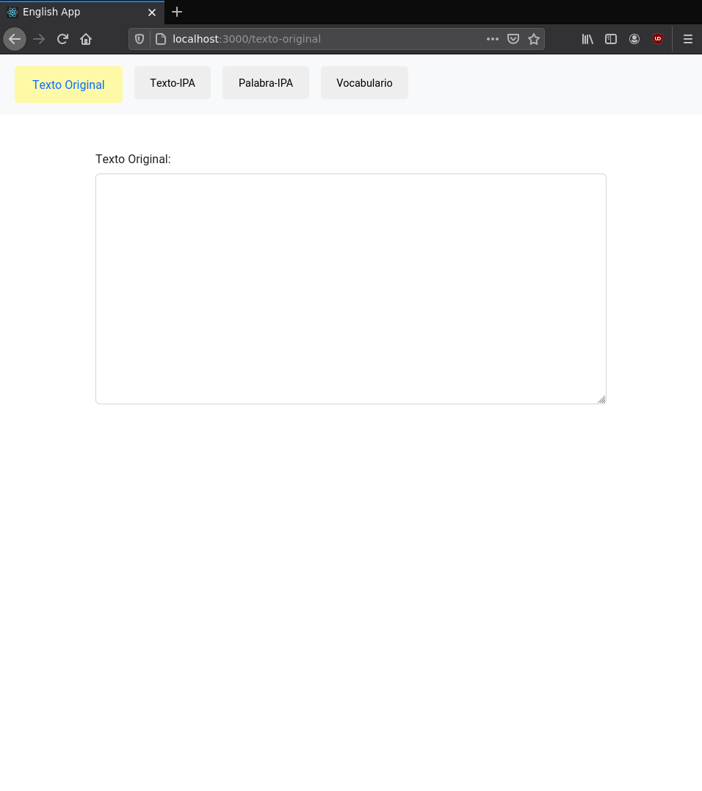
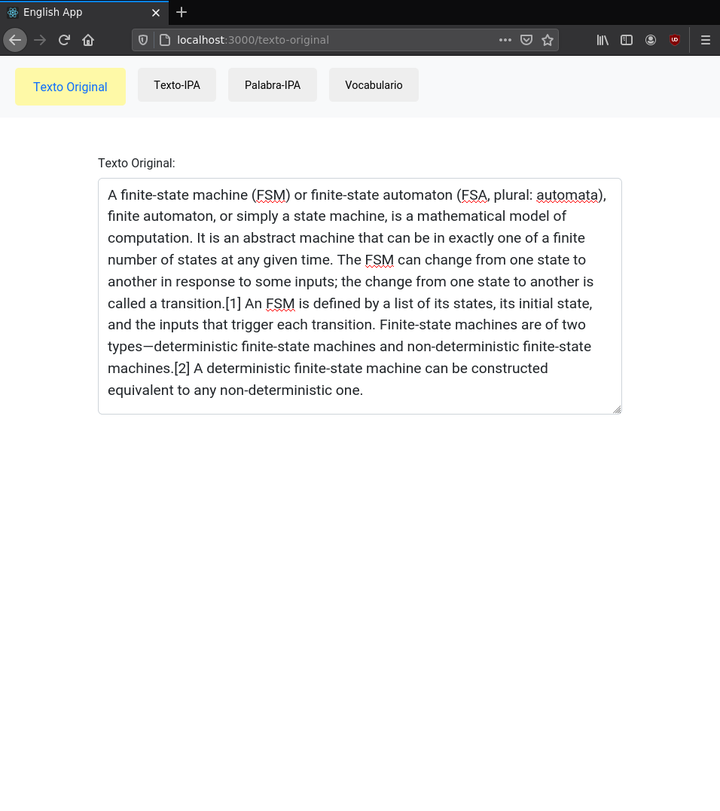
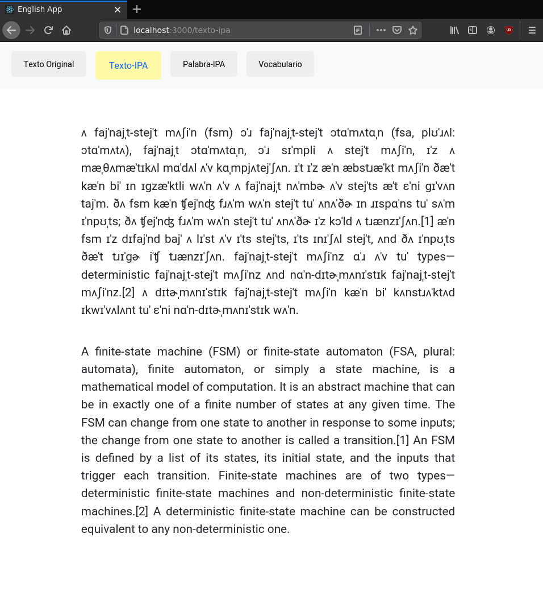
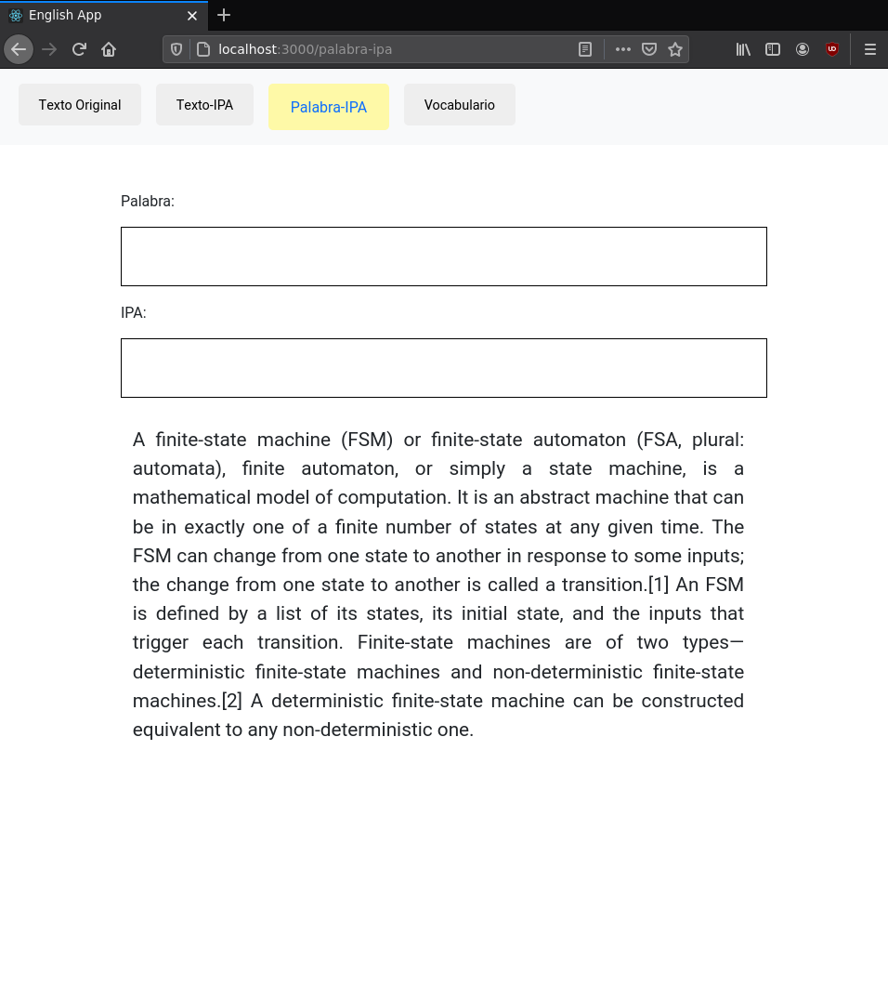
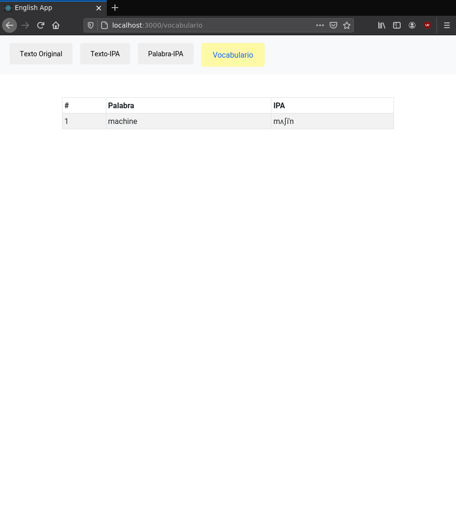
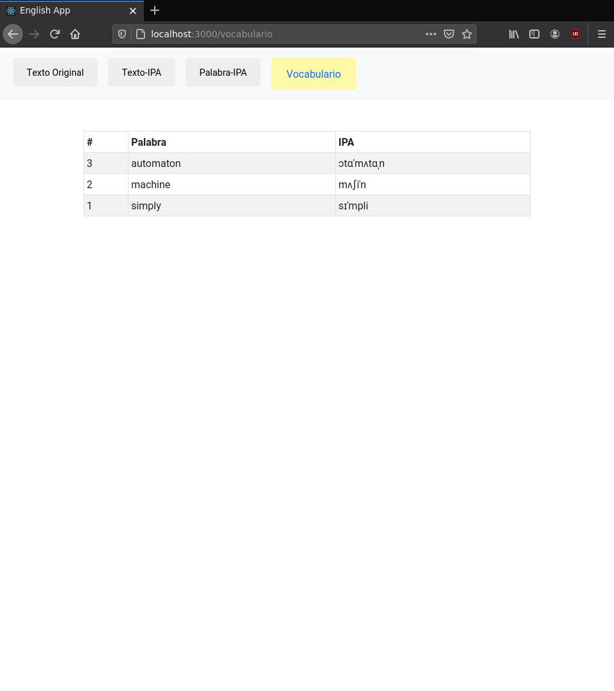

# English App 
> Una aplicación para practicar Inglés, usando el Alfabeto Fonético Internacional. 

> 🚧 Work in progress 🚧

This project was bootstrapped with [Create React App](https://github.com/facebook/create-react-app).


La idea de la aplicación es sencilla, usar el Alfabeto Fonético Internacional para generar la "pronunciación" de la palabra.


### AFI/IPA 

[AFI/IPA](https://es.wikipedia.org/wiki/Alfabeto_Fon%C3%A9tico_Internacional):

"El Alfabeto Fonético Internacional (AFI en español, API en francés e IPA en inglés) es un sistema de notación fonética creado por lingüistas. Su propósito es establecer, de forma regularizada, precisa y única, la representación de los sonidos del habla de cualquier lengua."


Diccionario: 

```shell
wget http://people.umass.edu/nconstan/CMU-IPA/CMU-in-IPA.zip
```


## Ejemplo


Empezamos con una página en blanco, en la que podemos escribir.




En éste ejemplo, copiamos/pegamos el siguiente fragmento (extraído de wikipedia):


> A finite-state machine (FSM) or finite-state automaton (FSA, plural: automata), finite automaton, or simply a state machine, is a mathematical model of computation. It is an abstract machine that can be in exactly one of a finite number of states at any given time. The FSM can change from one state to another in response to some inputs; the change from one state to another is called a transition.[1] An FSM is defined by a list of its states, its initial state, and the inputs that trigger each transition. Finite-state machines are of two types—deterministic finite-state machines and non-deterministic finite-state machines.[2] A deterministic finite-state machine can be constructed equivalent to any non-deterministic one. 




Si navegamos a la sección `Texto-IPA`, podremos ver el texto original junto a la versión `AFI/IPA`: 



En la sección `Palabra-IPA` podremos seleccionar palabras individuales: 




Cada palabra seleccionada en la sección `Palabra-IPA`, es agregada a nuestro vocabulario (sección `Vocabulario`):



Podemos agregar multiples palabras a nuestro vocabulario, se ordenan de acuerdo al número de veces que sean seleccionadas en la sección `Palabra-IPA`:




### Deploying / Publishing


```shell
```

### DEMO


[DEMO](https://diegoperezm.github.io/english-app)


## Licensing

"The code in this project is licensed under MIT license."
